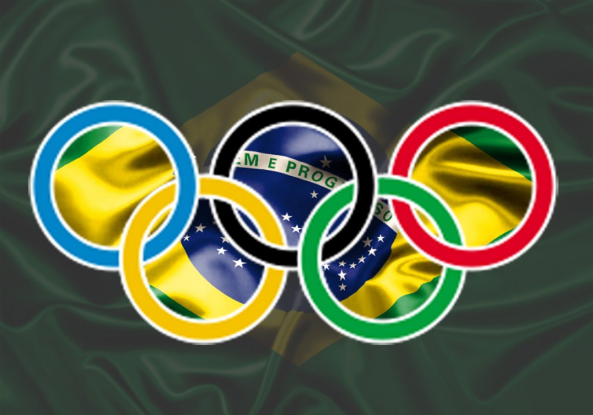

# Tabelas de medalhas dos Jogos Olímpicos (Brasil)

<<<<<<< HEAD:HTML/Tabelas.Jogos.Olímpicos.Brasil/README.md

=======

>>>>>>> 2c772f98e99bfebdc1e7248e7f587fb403783e9c:HTML/Tabelas/README.md

## Jogos Olímpicos

Jogos Olímpicos são um evento global com modalidades de verão e de inverno, em que milhares de atletas participam de várias competições.

