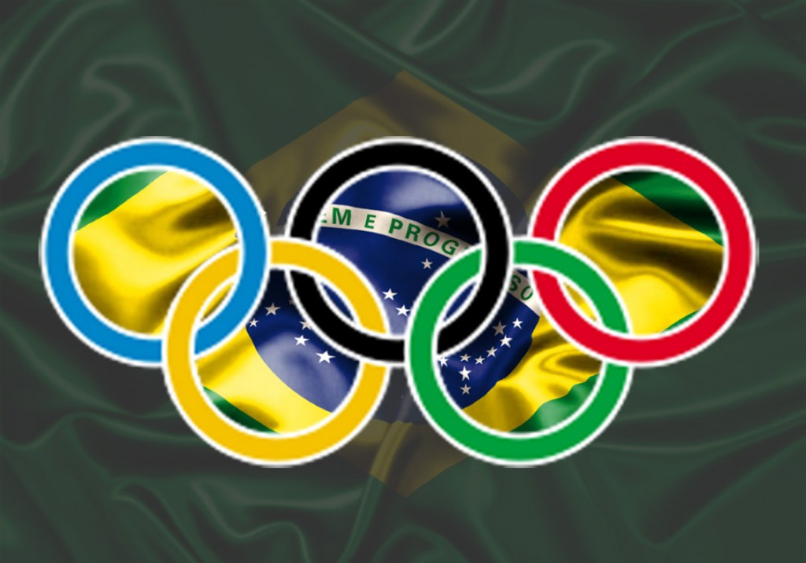

# Tabelas de medalhas dos Jogos Olímpicos (Brasil)

## Jogos Olímpicos

Jogos Olímpicos são um evento global com modalidades de verão e de inverno, em que milhares de atletas participam de várias competições.

